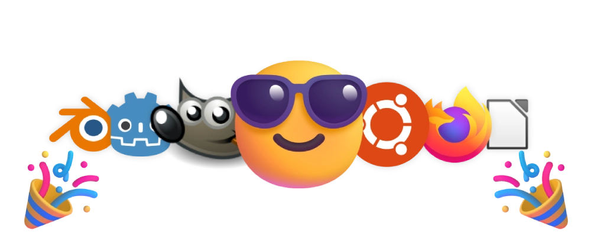

    

    

# Welcome! 👋

Here you can find a curated list of all the best free and open-source software for every need!

# Summary 📋

- [Audio 🎧](https://github.com/Superp0sit1on/awesome-open-source?tab=readme-ov-file#audio-)
- [Development 💻](https://github.com/Superp0sit1on/awesome-open-source?tab=readme-ov-file#development-)
- [Game Development 🎮](https://github.com/Superp0sit1on/awesome-open-source?tab=readme-ov-file#game-development-)
- [Graphics 🖼️](https://github.com/Superp0sit1on/awesome-open-source?tab=readme-ov-file#graphics-%EF%B8%8F)
- [Operational Systems 🖥️](https://github.com/Superp0sit1on/awesome-open-source?tab=readme-ov-file#operational-systems-%EF%B8%8F)
- [Productivity 📎](https://github.com/Superp0sit1on/awesome-open-source?tab=readme-ov-file#productivity-)
- [Social networks 💬](https://github.com/Superp0sit1on/awesome-open-source?tab=readme-ov-file#social-networks-)
- [Video 🎥](https://github.com/Superp0sit1on/awesome-open-source?tab=readme-ov-file#video-)
- [Web Browsing 🌐](https://github.com/Superp0sit1on/awesome-open-source?tab=readme-ov-file#web-browsing-)

---

# Audio 🎧

- [Ardour](https://ardour.org) - Comprehensive digital audio workstation for professional use.
- [Audacity](https://www.audacityteam.org) - The most famous digital audio editor.
- [Cider](https://cider.sh/) - Multi-platform and beautifully crafted Apple Music interface.
- [Rhythmbox](https://www.rhythmbox.org) - The traditional audio player from GNOME and community.

# Development 💻

- [Apache NetBeans](https://netbeans.apache.org) - Classic IDE for Java development.
- [Git](https://www.git-scm.com) - The most famous and used version-controlling system.
- [GitHub Desktop](https://desktop.github.com) - Git graphical interface for managing repositories. 
- [VSCodium](https://vscodium.com) - VSCode without any Microsoft telemetry.
- [Zed](https://zed.dev) - New IDE from the creators of Atom, focused on speed, collaboration, and optimal developer experience.

# Game Development 🎮

- [GDevelop](https://gdevelop.io) - No-code newbie-friendly game engine.
- [Godot](https://godotengine.org) - The most comprehensive and loved game engine.

# Graphics 🖼️

- [Blender](https://www.blender.org) - Most powerful 3D modelling tool.
- [Blockbench](https://www.blockbench.net) - 3D low-poly modelling tool.
- [Darktable](https://www.darktable.org) - Lightroom-like photo editing tool.
- [GIMP](https://www.gimp.org) - Most powerful image manipulation tool.
- [Inkscape](https://inkscape.org) - Traditional vector graphics editor.
- [Krita](https://krita.org) - Powerful illustration tool.
- [LibreCAD](https://www.librecad.org) - Traditional and powerful CAD tool.
- [LibreSprite](https://libresprite.github.io) - Pixel-art editor, forked from Aseprite.
- [penpot](https://penpot.app) - Self-hosted collaborative prototyping tool.
- [PhotoGIMP](https://github.com/Diolinux/PhotoGIMP) - Photoshop-like patched GIMP.

# Operational Systems 🖥️

- [Debian](https://www.debian.org) - The most famous and used Linux distro of all time, focused on security and stability.
- [Endless OS](https://www.endlessos.org) - The famous encyclopedia Linux distro.
- [Fedora](https://fedoraproject.org) - Enterprise-grade Linux distro from RedHat.
- [Kali Linux](https://www.kali.org) - The one Linux distro for hackers.
- [Manjaro](https://manjaro.org) - User-friendly and Arch-based Linux distro.
- [Mint](https://www.linuxmint.com) - Windows-like and user-friendly Linux distro.
- [Slackware](http://www.slackware.com) - The one Linux distro for hardcore users.
- [Tails](https://tails.net) - Privacy-focused Linux distro.
- [Ubuntu](https://ubuntu.com) - The most famous newbie-friendly Linux distro based on Debian.
- [Zorin OS](https://zorin.com/os) - Windows-like comprehensive Linux distro.
- [elementary OS](https://elementary.io) - macOS-like and friendly user experience.
- [openSUSE](https://www.opensuse.org) - Famous working-station Linux distro.
- [PopOS](https://pop.system76.com) - The comprehensive Linux distro for STEM and creative professionals.

# Productivity 📎

- [BitWarden](https://bitwarden.com) - Best-in-class password manager.
- [HedgeDoc](https://hedgedoc.org) - Self-hosted collaborative markdown note-taking.
- [Jitsi](https://meet.jit.si) - Easy and secure audio & video meetings.
- [Joplin](https://joplinapp.org) - Powerful note-taking application.
- [LibreOffice](https://www.libreoffice.org) - The most famous open-source Microsoft Office alternative.
- [Obsidian](https://obsidian.md) - Powerful note-taking and mind mapping application.
- [Ollama](https://www.ollama.com) - Self-hosted large language models (LLMs).
- [Thunderbird](https://www.thunderbird.net) - Famous email client from Mozilla.

# Social networks 💬

- [Forem](https://github.com/forem/forem) - Self-hosted forum platform from the creators of the DEV Community.
- [Mastodon](https://mastodon.social) - The most famous decentralized micro-blogging social network.
- [Pixelfed](https://pixelfed.org) - Decentralized photo sharing.
- [WordPress](https://wordpress.com) - The most famous blog authoring platform.
- [friendica](https://friendi.ca) - Traditional and decentralized social network.
- [writefreely](https://writefreely.org) - Self-hosted and distraction-free blog authoring tool.

# Video 🎥

- [kdenlive](https://kdenlive.org) - Powerful and comprehensive video editing tool.
- [OBS Studio](https://obsproject.com) - The most used and powerful live streaming tool.
- [OpenShot](https://www.openshot.org) - Powerful video editing tool.
- [Owncast](https://owncast.online) - Self-hosted live streaming platform.
- [PeerTube](https://joinpeertube.org) - Decentralized video-hosting platform. 
- [VLC](https://www.videolan.org) - Traditional and comprehensive player.

# Web Browsing 🌐

- [Firefox](https://www.mozilla.org/firefox/new) - Simply one of the most used browsers ever!
- [ungoogled-chromium](https://ungoogled-software.github.io) - Chromium (Chrome) without any Google telemetry and possibly annoying stuff.

---

# Want to contribute? 🤝

This list is updated occasionally (and currently manually 🥲) on the [DEV Community](https://dev.to/superp0sit1on/awesome-open-source-38h6) and is open to contributions on our [GitHub repository](https://github.com/Superp0sit1on/awesome-open-source)! So feel free to open a pull request and help the open-source community shine!

> 😎 Pro-tip: Don't forget to read our [code of conduct](CODE_OF_CONDUCT.md) and the [contributing guidelines](CONTRIBUTING.md).
